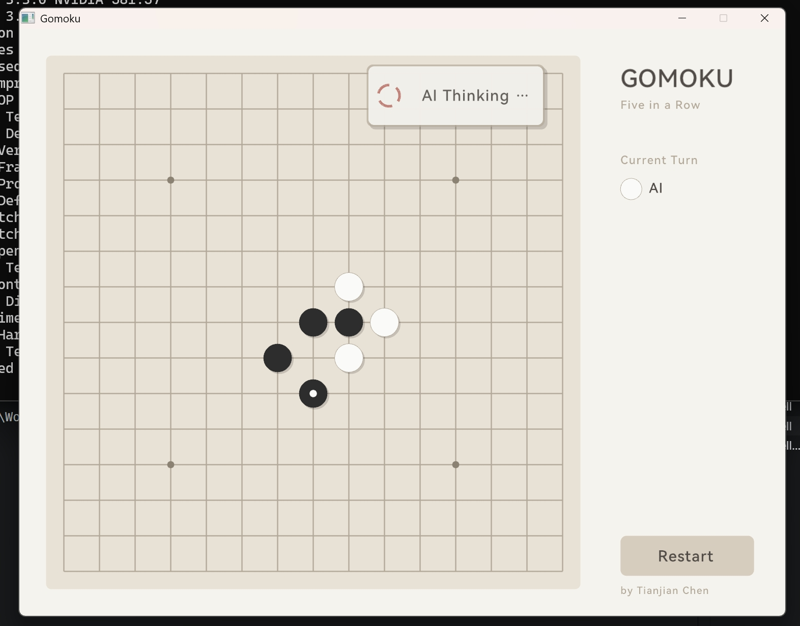

# Gomoku

A C++ implementation of the classic Gomoku (Five-in-a-Row) game, featuring both console and graphical interfaces.



## Build & Run

### Prerequisites
- MinGW-w64 (g++)
- Raylib library (for GUI version)

### Build
```powershell
# Build all versions
.\build.ps1 -Target all

# Console version only
.\build.ps1 -Target console

# GUI version only
.\build.ps1 -Target raylib
```

### Run
```powershell
# Console version
.\bin\gomoku_console.exe

# GUI version
.\bin\gomoku_ui.exe
```

## Usage

### Console Version
- Input format: `A1` - `O15` (column letter + row number)
- Type `quit` to exit

### GUI Version
- Click on the board to place stones
- Click "Restart" to start a new game
- Black (player) vs White (AI)

## Tech Stack

### Core
- **C++17**: Modern C++ features
- **Raylib**: Lightweight graphics library
- **Asynchronous Threading**: Non-blocking AI computation via `std::async`

### Build Tools
- **PowerShell Build Script**: Automated compilation
- **MinGW-w64 (g++)**: Static linking for standalone executables

## Algorithm

### 1. Minimax Search + Alpha-Beta Pruning
- **Search Depth**: 5 levels (configurable)
- **Pruning Efficiency**: Reduces ~60-70% of search nodes
- **Time Complexity**: O(b^d) → O(b^(d/2)) after pruning

```cpp
// Core search logic (ai.h)
int minimax(Board &board, Role role, int depth, Point lastMove, int alpha, int beta)
```

### 2. Heuristic Evaluation
- **Pattern Recognition**: Identifies 7 pattern types (five, live-four, dead-four, live-three, etc.)
- **Scoring System**:
  - Five: 1e6
  - Live-four: 1e5
  - Dead-four: 1e4
  - Live-three: 8e3
- **Defense Multiplier**: 1.2 (configurable K-Value)

```cpp
// Evaluation formula
Score = Σ(My Patterns) - 1.2 × Σ(Opponent Patterns)
```

### 3. Candidate Move Pruning
- **Range Restriction**: Only searches within 2 cells of existing stones (225→~50 candidates)
- **Heuristic Ordering**: Prioritizes high-value positions for better pruning

```cpp
// Candidate sorting (board.h)
vector<Point> getSortedCandidates(Role role)
```

### 4. Zero-Copy Line View
- **Iterator Pattern**: Supports range-based for loops
- **Lazy Evaluation**: Direct board access without memory allocation
- **Efficient Traversal**: Analyzes patterns across four directions

## Features

### Design
1. **Morandi Color Scheme**: Modern UI aesthetics
2. **Modular Architecture**:
   - `types.h` - Core type definitions
   - `board.h` - Board logic
   - `ai.h` - AI decision-making
   - Decoupled UI layer (console.cpp / game.cpp)

### Performance
1. **Asynchronous AI**: Non-blocking computation maintains 60 FPS
2. **Pruning Strategies**:
   - Alpha-Beta pruning reduces search tree
   - Candidate filtering (225→50 moves)
   - Heuristic ordering improves pruning efficiency
3. **Static Linking**: Single executable distribution

### User Experience
1. **Real-time Animations**:
   - AI thinking indicator (rotating spinner)
   - Game-over banner slide-in effect
   - Hover preview with semi-transparent stones
2. **High-DPI Support**: Optimized for high-resolution displays
3. **Dual Versions**:
   - Console: Lightweight, fast gameplay
   - Raylib: Polished UI with full game experience

## Project Structure
```
Gomoku/
├── src/
│   ├── headers/
│   │   ├── types.h      # Core type definitions
│   │   ├── board.h      # Board logic + evaluation
│   │   └── ai.h         # Minimax + Alpha-Beta pruning
│   ├── console.cpp      # Console version
│   └── game.cpp         # GUI version
├── build.ps1            # Automated build script
```

## Complexity Analysis

| Stage | Time Complexity | Notes |
|-------|----------------|-------|
| Candidate Generation | O(n²) | n=15 |
| Candidate Sorting | O(m log m) | m≈50 |
| Minimax Search | O(b^d) | b≈50, d=5 |
| After Alpha-Beta | O(b^(d/2)) | Effective b≈20-30 |
| Single Evaluation | O(n) | 4 directions × 9 cells |

## License

MIT License
